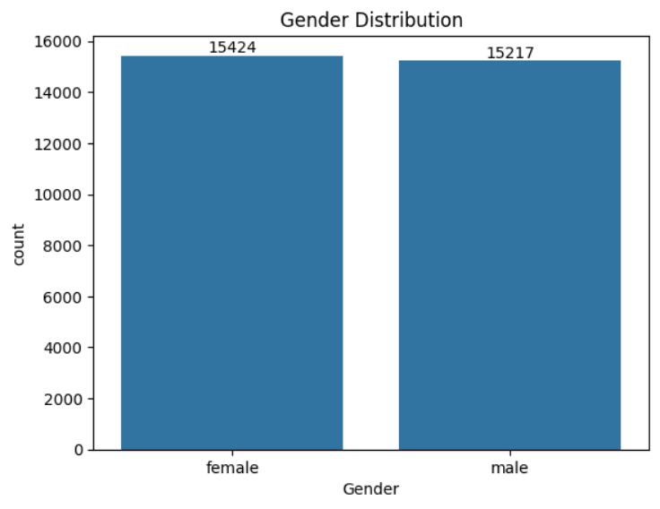
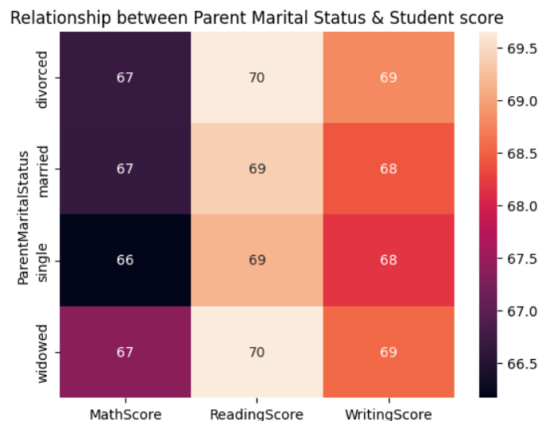
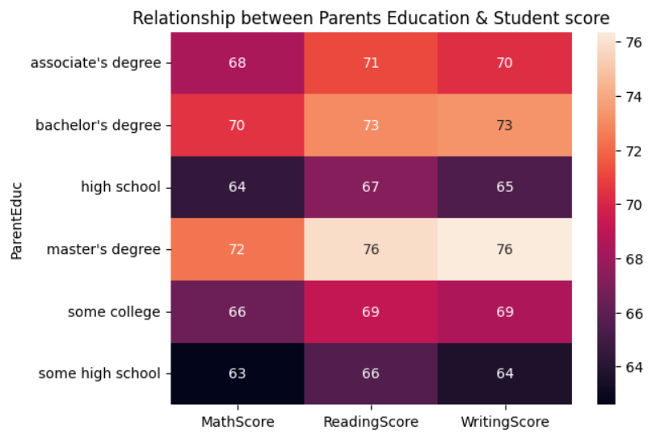
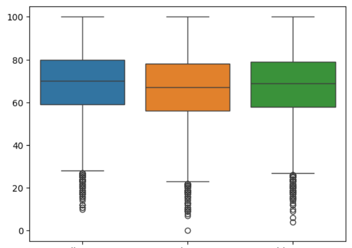
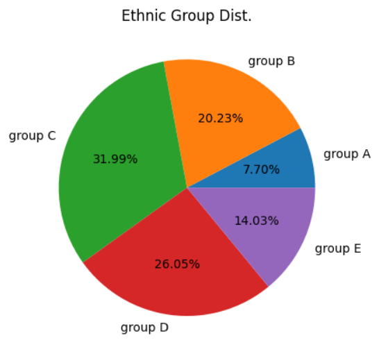
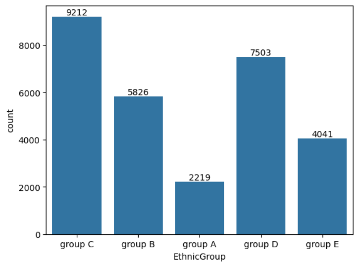

# Student Result Analysis

This repository contains a data analysis project focusing on student performance metrics, including Reading Scores, Math Scores, and Writing Scores. The goal is to explore trends, correlations, and insights into the dataset provided.

## Project Structure

The repository includes the following files:

- `Student Result Analysis.ipynb`: Jupyter Notebook containing the detailed data analysis process and visualizations.
- `student_scores.csv`: The dataset used for the analysis.
- `README.md`: This documentation file.

## Features

- **Data Exploration:** Initial statistics, missing values handling, and visualization.
- **Boxplots:** Comparative distribution of Reading, Math, and Writing scores.
- **Correlations:** Insights into relationships between different score categories.

## Installation and Requirements

Ensure you have the following installed:

- Python 3.x
- Required Python libraries (install via `pip`):
  - pandas
  - matplotlib
  - seaborn
  - numpy

Install the dependencies using:
```bash
pip install -r requirements.txt
```

## Usage

1. Clone the repository:
```bash
git clone https://github.com/Abs-Futy7/Student_Result_Data_Analysis.git
```

2. Navigate to the directory:
```bash
cd Student_Result_Data_Analysis
```

3. Run the Jupyter Notebook:
```bash
jupyter notebook "Student Result Analysis.ipynb"
```

## Dataset

The dataset used in this project is included in the repository as `student_scores.csv`. You can [download it here](./student_scores.csv).

## Visualizations

### Gender Count


### Parent Marital Status vs Student Score


### Parent Education vs Student Score


### Score Box Plot


### Ethnic Group Distribution


### Ethnic Group


## Contributions

Contributions are welcome! Feel free to fork the repository, make improvements, and submit a pull request.

## License

This project is licensed under the MIT License. See the `LICENSE` file for more details.

---

If you encounter any issues, feel free to open an issue in the repository.

Happy Analyzing! 🚀

